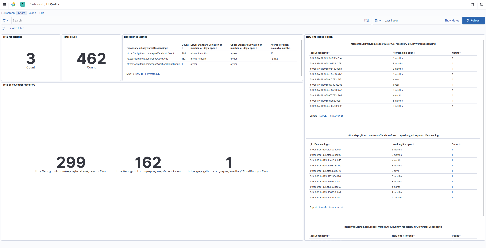
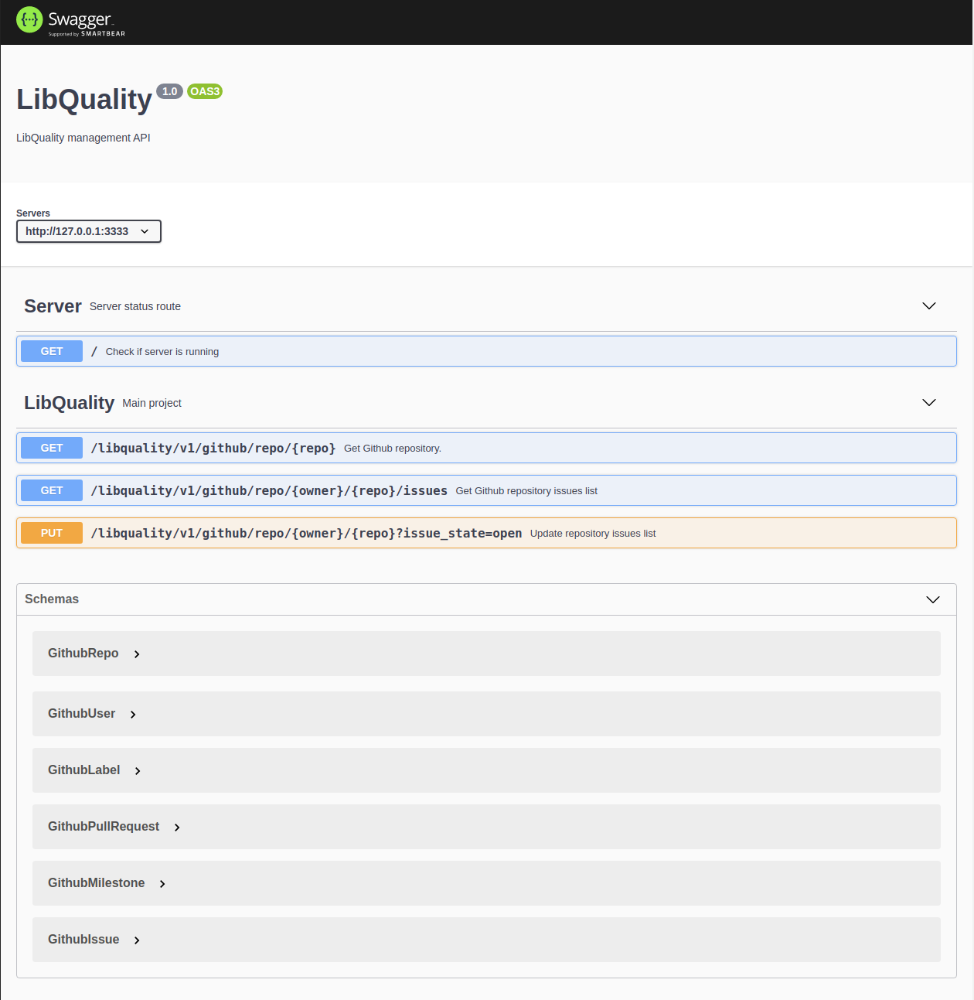
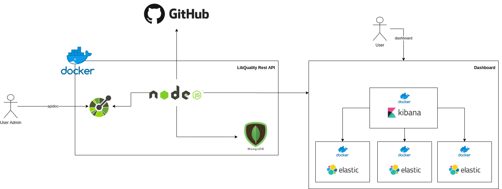

# LibQuality

Short description

## General Requirements

- OS Linux (only tested)
- Github (to download the project)
- Docker (v19.03 - tested)/DockerCompose (v1.25 - tested)
- Host must to be Swarm node. If it doesn't, run command bellow:
  
``` bash
docker swarm init
```

- Have **make** package installed. To it, run following command:

``` bash
sudo apt-get update && sudo apt-get install -y make
```

## Commands

To see available commands:

``` bash
make help
```

# Quickstart

### Create deploy.prop file

it is necessary create **deploy.prop** file, **because** the application will get the environment variables from it. To it, run the following command and fill it according to your needs

``` bash
cp deploy.example.prop deploy.prop
```

### Build the project

``` bash
make build
```

### Deploy the application

``` bash
make deploy
```

That's it!

## Addresses

- Swagger: [http://YOUR_IP:3333/apidoc](http://YOUR_IP:3333/apidoc)
- Kibana: [http://YOUR_IP:5601](http://YOUR_IP:5601)

## Screenshots

- Dashboard



- API documentation (Swagger)



- Architecture



# Summary

- Database
- Rest API
- Api documentation
- Dashboard
- Production environment

## Database

The database has 2 collections: **github_repo** and **github_issue**. Github_repo will store only the information about Github repository itself and Github_issue stores information about Github issues. The objects from both the collections has an attribute used as relationship key when needed (repository_url).

## Rest API

The LibQuality back-end core is the Rest API, developed in NodeJS (v14.14) and ExpressJS. It communicates with GithubApi (v3) from where repositories and their issues information are fetched. To this purpose, It is used Octokit package (@octokit/rest) which make it easier handle/fetch information from Github.

## Api Documentation

To facilitate integration from back-end and front-end development teams, and user admin validation, the available modules are mapped in Swagger api documentation ([http://YOUR_IP:3333/apidoc](http://YOUR_IP:3333/apidoc)).

## Dashboard

To enable user get information from registered data (usually to Business Intelligence purpose) the data are provided in Kibana (ElasticSearch+Kibana). The dashboards are highly customizable and it is possible build a presentation using the charts from Kibana itself ([http://YOUR_IP:5601/apidoc](http://YOUR_IP:5601/apidoc)).

## Production environment

To provide application it is used a docker stack (where the RestAPI and Mongo are stored) and dashboard services are provided in docker containers, but not in docker stack (3 ElasticSearch instances and 1 to Kibana).

# Development mode

## Requirements

- Production environment requirements
- Yarn


### Create .env file and fill it with your development environment variable

``` bash
cp .env.example .env
```

### Install development dependencies

```bash
yarn
```

### Deploy dashboard and database in development mode

```bash
make deploy-dev
```

### Run development server

```bash
yarn dev
```

Access it apidoc in [http://YOUR_IP:3333/apidoc](http://YOUR_IP:3333/apidoc)

# Tests

## Requirements
- Development requirements

## Install dependencies
``` bash
yarn
```

## Run tests
``` bash
make run-tests
```


# Issues/Solutions

- I am not able to access dashboard
  - run the command **docker ps**, if you are not seeing ELK stack running, they are stopped. In most cases running the command bellow, solves the problem. After run the command, try to deploy dashboard stack again. ( PS: *You will need to have **sudo** permission*)

``` bash
sudo sysctl -w vm.max_map_count=262144
```
